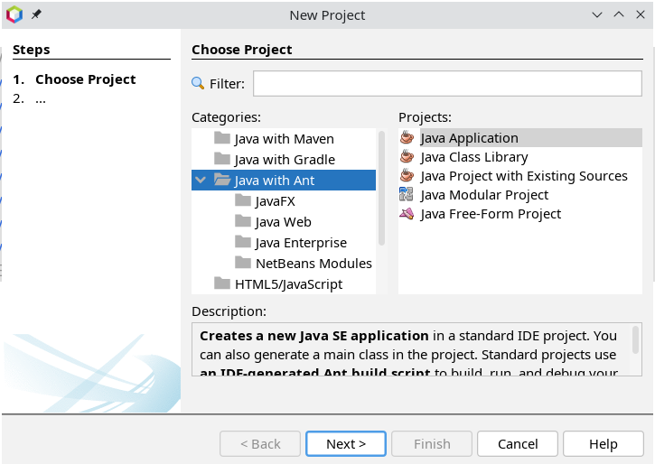
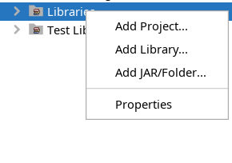
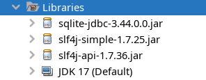
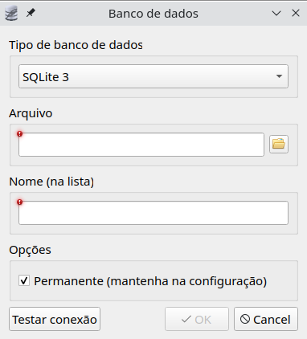
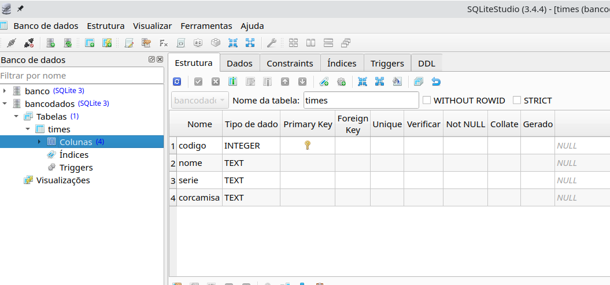

# Avaliação A3
## UC - Programação de Soluções Computacionais - 2023/2


### professor
>Marcelo Amorim

Descrição e documentação do projeto **A3 2023/2** da **Unidade curricular de Programação de Soluções Computacionais**. 

## SUA MISSÃO
	
Desenvolver em **Java** um sistema Desktop (usando janelas) simples de cadastro com as funcionalidades **CRUD** utilizando como persistencia das informações o banco de dados **SQLite**.

>**O que é CRUD?**
>Acrônimo para representar as operações a serem realizadas com as informações representadas por uma entidade do modelo de dados. (Create, Read, Update, Delete)

>**O que é o SQLite?**
>O SQLite é uma base de dados relacional de código aberto e que dispensa o uso de um servidor na sua atuação. Armazenando seus arquivos dentro de sua própria estrutura, ele é capaz de funcionar muito bem em aplicações diversas, principalmente, websites de tráfego médio e sistemas mobile.

## Critérios

* Todo projeto deverá desenvolver uma entidade para persistir usuários e ter seu respectivo CRUD implementado. 
* Todo projeto deverá ter uma tela inicial de login que valide um usuário a partir da entidade do item anterior.
* Cada grupo deverá desenvolver pelo menos dois CRUDs.

Deixaremos a critério de cada grupo a escolha das entidades de dados que serão utilizadas para os CRUDs. Lembre-se que este projeto será apresentado ao professor. Portanto façam a escolha por algumas entidades que tenham atributos suficientes que descreva a entidade corretamente de forma simples  e pensando em como justificá-las. 

## Sobre a entrega

**DATA DA ENTREGA: 12/12/2023**

O projeto deverá ser disponibilizado em um repositório do Github de algum dos integrantes do grupo e deverá conter obrigatóriamente:
1. RA e Nome completo dos integrantes
2. Código fonte da implementação em Java
3. Arquivo SQLite de banco de dados.
4. Texto **README.md** contendo RA e Nome completo dos integrantes e explicações sobre os CRUDs utilizados no projeto. 
5. Apenas um integrante deve enviar um email com o assunto **PSC2023-2 A3 GRUPO XX** para ```marcelo.amorim@saojudas.br``` contendo:
    1. RA e Nome completo dos integrantes
    2. Link (endereço) gitHub do projeto
   
## GRUPOS

[Formulário para indicação dos grupos](https://forms.gle/5Tdfw4hdqPMshEQ36)

Lista de GRUPOS / Integrantes **[VER LISTA](./grupos.md)**

## Por onde começar? Conhecendo um projeto padrão de exemplo

Para auxiliar no desenvolvimento e aprendizagem que será adquira com este projeto, nesta fase é apresentado um modelo de projeto utilizando o **netbeans** como IDE de desenvolvimento. O projeto será desenvolvido e detalhado durante as aulas e a medida que as aulas avançam, as atualizações são realizadas podendo ser acessado na pasta deste repositório localizado em [ProjetoA3](./ProjetoA3/). 

### E se eu quiser desenvolver do zero? Quais foram os passos durante a construção deste modelo de projeto?

Vamos lá. 

#### 1. Criando o projeto netbeans
> O projeto que desenvolvemos em aula utilizou o tipo de projeto **Java with Ant**. Escolher no momento da criação do projeto:



#### 2. Adicionar as bibliotecas JAR para o SQLite
> Fizemos o download dos seguintes arquivos armazenando na pasta raiz do projeto criado no passo anterior (conforme pode ser encontrado em [ProjetoA3](./ProjetoA3/).):
> * [slf4j-api-1.7.36.jar](./ProjetoA3/slf4j-api-1.7.36.jar).
> * [slf4j-simple-1.7.25.jar](./ProjetoA3/slf4j-simple-1.7.25.jar).
> * [sqlite-jdbc-3.44.0.0.jar](./ProjetoA3/sqlite-jdbc-3.44.0.0.jar).
>
> Para adicionar as bibliotecas (arquivos .jar) ao projeto, clicar (botão direita) sobre o item **Libraries** e escolher opção **Add jar/folder** e escolher os arquivos acima que deverão ser localizados na pasta raiz do seu projeto. 
>  

#### 3. Classes **COM SUPER PODERES** desenvolvidas em aula para ajudar no projeto
> **Classe [BD.java](./ProjetoA3/src/projetoa3/BD.java)**
##### Como usar? Exemplos?
```~java
DB db = new DB("bancodados.db");
db.query("SELECT * FROM times");
while(db.next()) {
    int codigo = db.getInt("codigo");
    String nome = db.getString("nome");
    System.out.println("CODIGO: "+codigo+" NOME: "+nome);
}
db.closeConnection();
```

> **Classe [TableRender.java](./ProjetoA3/src/projetoa3/TableRender.java)**
##### Para que serve? 
Utilizar para popular com dados o componente JTable do Java na janela gráfica.

##### Exemplo?
```~java
DB db = new DB("bancodados.db");
db.query("SELECT * FROM times");
String cols[] = { "CODIGO", "NOME DO TIME", "SERIE", "COR" };
String fields[] = { "codigo", "nome", "serie", "corcamisa" };        
TableRender.render(table, cols, fields, db);
db.closeConnection();
```

#### 4. Criando um **BANCO DE DADOS LEGAL** SQLite com o SQLiteStudio 
> **O que é o SQLiteStudio?**
> É um software multiplataforma e portável para ajudar a gerenciar bancos de dados SQLite.
> Link para o sqlitestudio [sqlitestudio.pl](https://sqlitestudio.pl/)
> **NOTA IMPORTANTE:** Sugiro a escolha da opção para download portable (arquivo compactado .zip). Descompactar e executar o arquivo da aplicação.

#### Escolher um bom nome para seu banco e lembar de salvá-lo na pasta raiz do projeto! 


Seguir na criação das tabelas conforme explicao em aula. 


#### 5. Como conectar e acessar o banco?
> Um exemplo pode ser visto na classe principal na pasta do projeto [ProjetoA3/src/projetoa3/ProjetoA3.java](./ProjetoA3/src/projetoa3/ProjetoA3.java).

#### 6. Como desenvolver as janelas?
> Exemplos podem ser visto nas classes:
> * JANELA CRUD [ProjetoA3/src/projetoa3/Times.java](./ProjetoA3/src/projetoa3/Times.java).
> * JANELA CADASTRO [ProjetoA3/src/projetoa3/TimesCad.java](./ProjetoA3/src/projetoa3/TimesCad.java).